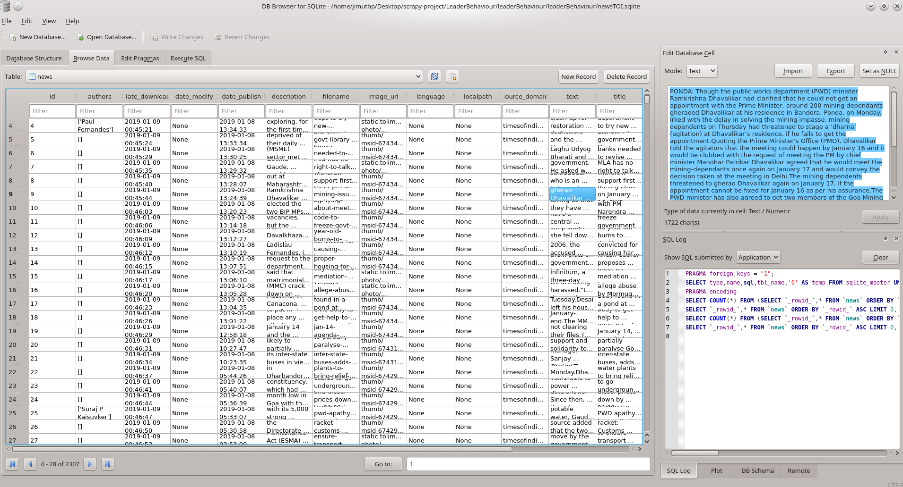

# Leader Behaviour Prediction
This project will deal with extracting and gathering information about the behaviour/ bad work (corresponding to predefined adjectives ) of a leader/ representative by constantly scraping news website.

## Installing required libraries

```
sudo pip install requirements.txt
```

## Scraping Times of India website

I have scraped [Times Of India Website](https://timesofindia.indiatimes.com/) specially for this purpose.

#### The dataset got after scraping Times of India website 

This dataset have the details of the scrapped article. We have to scrap the text and get the names.
Then we have to match the details of the adjective with the matched names that is got.

The dataset is present in the path :

```
LeaderBehaviour/leaderBehaviour/leaderBehaviour/spiders/newsTOI.sqlite
```




#### Scraped names of the members of parliaments in [US](https://github.com/Jimut123/LeaderBehaviour/blob/master/getUSNames/getUSNames/spiders/getUSNames.json) :

```
LeaderBehaviour/getUSNames/getUSNames/spiders/getUSNames.json
```

#### Scraped the names of the members of parliaments in [India](https://github.com/Jimut123/LeaderBehaviour/blob/master/getIndianPolNames/getIndianPolNames/spiders/getIndianPolNames.json) :

```
LeaderBehaviour/getIndianPolNames/getIndianPolNames/spiders/getIndianPolNames.json
```

#### Additional Objectives :

    * used headers/ user-agent in scrapy.
    * need to use proxy/ integrate with Tor to make it completely untraceable.

#### Note :

With such small data, the available set of information is not found. This repo will be updated shortly!
I have extracted the probable names from the text, need to just match it with every article in the text.

#### Possible [name](https://github.com/Jimut123/LeaderBehaviour/blob/master/leaderBehaviour/leaderBehaviour/spiders/probable_names_extracted.json) extraction from the extracted text :

```
LeaderBehaviour/leaderBehaviour/leaderBehaviour/spiders/extractNamesTOI.py
LeaderBehaviour/leaderBehaviour/leaderBehaviour/spiders/probable_names_extracted.json
```

